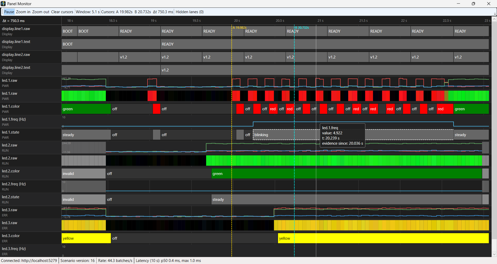

# TopicMonitor

TopicMonitor is a generic, timestamped topic bus with a gRPC server, a .NET client library, and a WPF
timeline viewer — built to watch many fast-changing values (sensor readings, LED states, display text,
anything with a name and a value over time) side by side on one shared, scrollable, zoomable time axis.
A replayable scenario file drives the data for development and testing, so the whole pipeline — bus,
derived-value processors, gRPC transport, client reconnect logic, and the viewer itself — runs and is
testable without any real hardware attached.



See [docs/plan.md](docs/plan.md) for the full design and phased implementation plan.

## Solution layout

- `src/TopicMonitor.Contracts` — `.proto` definitions and generated gRPC/C# types
- `src/TopicMonitor.Core` — topic bus, descriptors, samples, publish policies, history
- `src/TopicMonitor.Processors` — color classifier, blink detector, text stabilizer
- `src/TopicMonitor.Sources.File` — scenario (`.scn`) parser, expander, replayer, file watcher
- `src/TopicMonitor.Server` — Kestrel host, gRPC services, configuration
- `src/TopicMonitor.Client` — catalog, subscription, state store, history, reconnect
- `src/TopicMonitor.Viewer.Layout` — YAML layout model, template expansion, style resolution
- `src/TopicMonitor.Viewer.Wpf` — timeline control, lane renderers, interaction
- `tests/TopicMonitor.Tests.Unit` — unit tests (deterministic, no GUI)
- `tests/TopicMonitor.Tests.Integration` — local integration tests over real gRPC

## Build and test

```
dotnet build
dotnet test
```

## Run

```
dotnet run --project src/TopicMonitor.Server
dotnet run --project src/TopicMonitor.Viewer.Wpf -- --server http://localhost:5279 --layout examples/layout.yaml
```

Edit `examples/demo.scn` to change the data and `examples/layout.yaml` to change the view; both reload live.
Viewer: wheel zooms, drag pans (pauses), click pins a value, Ctrl+click places cursors A/B, right-click a lane to change its renderer or save unassigned lanes to the layout file.
