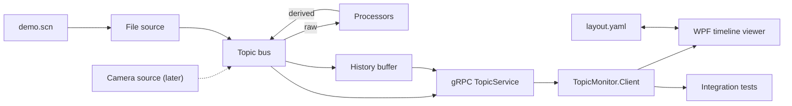

# Topic Monitor – Implementation Plan v1

*As of 2026-10-06*

## 1. Goal and scope

v1 delivers a generic, timestamped topic server fed by an editable scenario file, plus a generic WPF timeline viewer whose lanes are defined by a YAML layout file. Editing the scenario file changes the data live; editing the layout (in the file or in the GUI) changes the view. Automated tests run without any GUI.

**Final result**

- Server (.NET 8): topic bus, history buffer, derived-topic processors, gRPC API.
- Scenario file source: timed changes of raw topics; replay restarts automatically when the file changes.
- C# client library: used by the viewer and by the tests.
- WPF timeline viewer: one shared time axis, lanes of topics, renderers and styles from `layout.yaml`; GUI changes are saved back to the file.
- Test suite without GUI: unit tests and local integration tests (file → server → gRPC → test client → assertions).

**Out of v1:** Camera integration, camera-parameter RPCs, pattern/measurement library, TLS and authentication, remote clock sync, installation as a Windows Service.

## 2. Decisions

| Topic | Decision |
|---|---|
| Runtime | .NET 8 |
| Transport | gRPC (grpc-dotnet on Kestrel): server-streaming plus unary RPCs |
| Core model | Generic timestamped topic bus; producers publish atomic samples |
| Value types | `float`, `int`, `bool`, `string`, `enum[...]`, `vec[names]` – no color type |
| Raw LED value | One topic per LED, `vec[r,g,b]`; the server does not know it is a color |
| Derived topics | Computed on the server by configurable processors (color, frequency, state, text) |
| Publish policy | Declared by each producer when it registers a topic |
| Quality | Optional confidence per value, separate from validity |
| Time base | `Stopwatch.GetTimestamp()` (QPC), comparable across processes on one machine; UTC added for remote use |
| Test time | `TimeProvider`; `FakeTimeProvider` in tests |
| Scenario file | Custom line format (`.scn`), watched, auto-restart |
| Layout file | YAML, read and written by the viewer |
| Viewer | Generic WPF timeline: renderer default per type, user-selectable per lane |
| Tests | No GUI tests; unit and local integration tests |

## 3. Architecture



Only the file source is replaced when a camera source arrives. The viewer and the integration tests share `TopicMonitor.Client`, so a green test means the viewer receives the same data.

| Project | Content | Depends on |
|---|---|---|
| `TopicMonitor.Contracts` | `.proto` files, generated C# types | – |
| `TopicMonitor.Core` | Topic bus, descriptors, samples, publish policies, history, validity | – |
| `TopicMonitor.Processors` | Color classifier, blink detector, text stabilizer | Core |
| `TopicMonitor.Sources.File` | Scenario parser, expander, replayer, file watcher | Core |
| `TopicMonitor.Server` | Host: Kestrel, gRPC services, configuration | Core, Processors, Sources.File, Contracts |
| `TopicMonitor.Client` | Catalog, subscription, state store, history, reconnect, time conversion | Contracts |
| `TopicMonitor.Viewer.Layout` | YAML model, template expansion, style resolution, save | – |
| `TopicMonitor.Viewer.Wpf` | Timeline control, lane renderers, interaction | Client, Viewer.Layout |
| `TopicMonitor.Tests.Unit` | Parser, expander, bus, processors, state store, layout | all non-GUI projects |
| `TopicMonitor.Tests.Integration` | Real Kestrel on localhost, test client, latency suite | Server, Client |

`TopicMonitor.Viewer.Layout` has no WPF dependency, so layout logic is unit-testable.

## 4. Scenario file (`.scn`)

A line-based text file: directives declare topics, each data line is one atomic sample at a time offset. Values hold until changed, so the file lists only changes.

```
# demo.scn
@source cam rate=20                      # one sample every 50 ms; times snap to the next tick
@topic led.1.raw  vec[r,g,b]
@topic led.2.raw  vec[r,g,b]
@topic led.3.raw  vec[r,g,b]
@noise led.*.raw sigma=6                 # optional Gaussian noise per component

@source ocr rate=2                       # reading display text is far slower than reading LEDs with a camera
@topic display.line1.raw string
@topic display.line2.raw string

# t      changes
0        led.1.raw=(0,0,0)  led.2.raw=(0,0,0)  led.3.raw=(0,0,0)  display.line1.raw="BOOT"  display.line2.raw=""
500      led.1.raw=(240,20,20)
+100     led.1.raw=(0,0,0)               # relative: 600 ms
1200     led.2.raw=(20,230,30)  display.line1.raw="READY"  display.line2.raw="v1.2"  # display text snaps to ocr's own next tick (1500 ms)
1500     led.1.raw=blink((240,20,20),(0,0,0),5Hz)
2000     led.3.raw=(230,200,20)
4000     led.1.raw=ramp((240,20,20),(20,230,30),100ms)
4500     led.2.raw=!                     # invalid / no data
5000     display.line1.raw=flicker("READY","REA0Y",1)
7000                                     # bare time, no assigns: gives ocr's slower tick a few ticks to
                                         # actually alternate the flicker before @loop wraps everyone back
@loop
```

**Grammar**

```
file       = { line } ;
line       = ( directive | sample | comment | empty ) , EOL ;
directive  = "@source" name "rate=" int
           | "@topic" topic type [ "policy=" policy ]
           | "@noise" topicglob "sigma=" number
           | "@loop" ;
sample     = time { assign } ;
time       = [ "+" ] int [ "ms" | "s" ] ;
assign     = topic "=" value [ "~" confidence ] ;
value      = literal | "!" | generator ;
literal    = number | string | bool | enumname | vector ;
vector     = "(" number { "," number } ")" ;
generator  = "blink(" value "," value "," freq [ "," duty ] ")"
           | "ramp(" value "," value "," duration ")"
           | "flicker(" value "," value "," frames ")" ;
type       = "float" | "int" | "bool" | "string" | "enum[" names "]" | "vec[" names "]" ;
policy     = "every" | "change" | "deadband(" number ")" ;
```

**Semantics**

- A topic has exactly one producer; a file topic that a processor also publishes is rejected at load.
- A file may declare several `@source` blocks, each at its own rate; each one owns the `@topic` directives
  declared after it, until the next `@source`. This is the mechanism for giving different topics a
  realistic, independent sample rate (e.g. a fast camera source for LEDs alongside a much slower one for
  display text, which a real system would read far less often than it reads LED color/blink) rather than
  forcing every topic in the file onto one global rate. A `@topic` declared before any `@source` directive
  is a validation error. Each source gets its own independent tick timer and publishes its own `Sample`s
  (tagged with its own `SourceId`); `@loop`'s wraparound point is anchored to the file's shared last
  explicit event time, converted to each source's own tick units, so every source loops back to t = 0 at
  the same real-world instant even though that lands on a different tick index for each one's own rate.
- Times (including a generator's `frames` unit, e.g. `flicker`'s) are quantized up to the next tick of
  whichever `@source` owns the topic being assigned; a sample line may freely mix assignments to topics
  owned by different sources, each quantized independently.
- A generator runs until the next assignment to that topic.
- `~` sets confidence; `!` marks the topic invalid until its next value.
- `@loop` restarts at t = 0; without it, the last state holds.
- Parse errors report line and column; the server keeps the last valid scenario running.

## 5. Server internals

```csharp
interface ITopicBus {
    TopicHandle Register(TopicDescriptor d);   // name, type, unit, kind, policy, producer
    void Publish(Sample s);                    // atomic: values observed at one instant
    IAsyncEnumerable<Sample> Subscribe(TopicFilter f, long? fromTime, DeliveryMode m);
}
record Sample(SourceId Source, ulong Seq, long T, long TPrev, long TProcessed,
              IReadOnlyList<TopicValue> Values);           // empty Values = tick
record TopicValue(TopicHandle Topic, Value V, float? Confidence,
                  Validity Validity, long? EvidenceSince);
```

**Bus rules**

- Every source tick produces a sample, even without changes.
- Publish policies are applied by the bus, per topic.
- A source that stops sets all its topics to `Invalid`.
- History: time-based ring buffer of all samples, default 5 min (configurable).
- Delivery modes: `Lossless` (bounded queue; a subscriber behind the buffer is disconnected with a resync code) and `Latest` (coalesces to the newest state).

**Processors v1**

| Processor | Input → output | Rule (configurable) | Inherent delay |
|---|---|---|---|
| Color classifier | `led.N.raw` → `led.N.color` (enum) + confidence | Nearest reference in the configured color space; confidence from the margin to the second-nearest; new color after k equal samples (default k = 2) | k − 1 samples |
| Blink detector | `led.N.color` → `led.N.state` (enum off/steady/blinking), `led.N.freq` (Hz) | State from the last 2 periods; frequency on change with deadband | ≥ 1 period |
| Text stabilizer | `display.lineN.raw` → `display.lineN.text` | New text after k equal samples (default k = 2) | k − 1 samples |

Color classifier configuration:

```yaml
color:
  - input: led.*.raw
    space: rgb
    components: [r, g, b]
    references:
      off:    [0, 0, 0]
      red:    [240, 20, 20]
      green:  [20, 230, 30]
      yellow: [230, 200, 20]
```

A derived value is stamped with the time of the triggering sample; `EvidenceSince` points at the first supporting sample.

## 6. gRPC API v1

```proto
service TopicService {
  rpc Describe(DescribeRequest) returns (TopicCatalog);
  rpc Subscribe(SubscribeRequest) returns (stream SampleBatch);
  rpc GetTime(TimeRequest) returns (TimeReply);
}

message TopicCatalog { repeated TopicInfo topics = 1; uint64 catalog_version = 2; }
message TopicInfo {
  uint32 id = 1; string name = 2; ValueType type = 3; string unit = 4;
  TopicKind kind = 5; string producer = 6; repeated string derived_from = 7;
  repeated string enum_values = 8;   // enum only
  repeated string components = 9;    // vec only, e.g. ["r","g","b"]
}
message SubscribeRequest {
  repeated string patterns = 1;      // "led.*.state", "display.line*.text"
  optional int64 from_time = 2;      // replay from history, then live
  DeliveryMode mode = 3;             // LOSSLESS | LATEST
}
message SampleBatch {
  uint64 seq = 1; string source = 2;
  int64 t = 3; int64 t_prev = 4; int64 t_processed = 5; int64 t_publish = 6;
  int64 t_utc_us = 7;
  bool is_snapshot = 8;
  uint64 catalog_version = 9;
  repeated TopicValue values = 10;   // empty = tick
}
message TopicValue {
  uint32 topic = 1;
  oneof v { bool b = 2; int64 i = 3; double d = 4; string s = 5; uint32 enum_index = 6; Vec vec = 7; }
  optional float confidence = 8;
  Validity validity = 9;             // VALID | INVALID
  optional int64 evidence_since = 10;
}
message Vec { repeated double values = 1; }   // order = TopicInfo.components
message TimeReply { int64 server_mono = 1; int64 server_utc_us = 2; int64 mono_frequency = 3; }
```

- Timestamps are QPC ticks; `mono_frequency` converts them to seconds.
- A scenario reload that changes topics bumps `catalog_version`; clients call `Describe()` again.
- Keepalive pings detect dead clients within seconds.

## 7. Client library (`TopicMonitor.Client`)

- **Connect:** `Describe()`, then `Subscribe()` with patterns and delivery mode.
- **State store:** value, confidence, validity and timestamps per topic; one change event per sample batch.
- **History:** per-topic time series for the visible window and beyond (viewer reads from it).
- **Reconnect:** resumes with `from_time` = last received `t`; a `seq` gap triggers a resync.
- **Catalog changes:** refetch on new `catalog_version`.
- **Time:** same machine uses server timestamps directly; `GetTime()` offset estimation is wired in for remote clients.
- **Latency probe:** records `recv − t_processed` per batch.

## 8. Timeline viewer (WPF)

The viewer knows only topics, types and the layout. One shared time axis; each lane shows one topic with one renderer.

**Renderers**

| Renderer | Applies to | Default for |
|---|---|---|
| `step` | float, int | float, int |
| `lines` | vec (one line per component) | vec |
| `digital` | bool | bool |
| `boxes` | enum, string, float, int | enum, string |
| `swatch` | vec with 3 components + `space` | – |

**Style resolution (in this order)**

1. Type default: renderer and neutral style.
2. Value rules from the layout, e.g. `red` → red fill, `blinking` → dashed border.
3. Quality overlay: low confidence → hatched; invalid → grey.

**Layout file (`layout.yaml`)**

```yaml
window: 10s

styles:
  red:      { fill: red }
  green:    { fill: green }
  yellow:   { fill: yellow }
  off:      { fill: "#333" }
  blinking: { border: dashed }
  "@low":     { hatch: true }
  "@invalid": { fill: "#888" }

templates:
  led:
    - { topic: "{p}.raw",   as: lines }
    - { topic: "{p}.raw",   as: swatch, space: rgb }
    - { topic: "{p}.color" }
    - { topic: "{p}.freq",  unit: Hz, range: [0, 10] }
    - { topic: "{p}.state" }

groups:
  - name: Display
    lanes:
      - { topic: display.line1.text }
      - { topic: display.line2.text }
  - { name: PWR, use: led, p: led.1 }
  - { name: RUN, use: led, p: led.2 }
  - { name: ERR, use: led, p: led.3 }
```

**Interaction**

- Hover: value, `t`, confidence, `evidence_since`; click pins the expanded content (full text of string boxes).
- Lane context menu: change renderer and style; changes are saved to `layout.yaml`.
- Pause freezes the view while data continues into history; zoom and pan on the time axis.
- Two cursors with a Δt readout.
- The viewer watches `layout.yaml`; external edits apply without restart.
- At connect, the layout is checked against `Describe()`; missing or unused topics are listed.
- Status bar: connection, scenario version, sample rate, live `recv − t_processed` (p50 and max over 10 s).

**Implementation**

- Custom timeline control drawn with `DrawingVisual`; one control renders all lane types.
- Box labels are drawn only when the box is wide enough; otherwise on hover.
- UI updates are batched per frame on the dispatcher.
- YAML via YamlDotNet; load errors report line and column and keep the last valid layout.

## 9. Test strategy (no GUI)

All tests run with `dotnet test`; scenarios are inline strings in `.scn` format.

**Unit tests (deterministic, `FakeTimeProvider`)**

- Scenario parser and expander: grammar, errors with line/column, quantization, generators, `@loop`, seeded noise.
- Bus: policies, ticks, invalidation, history window, snapshot, single producer per topic.
- Processors: classification per reference, confidence margin, k-sample rule, blink state and frequency, `evidence_since`.
- Client state store: deltas, gap detection, catalog change.
- Layout: YAML load, template expansion, style resolution order, renderer applicability per type, save/load round trip.

**Integration tests (real Kestrel on a random localhost port)**

```csharp
[Fact]
public async Task Red_pulse_is_classified_with_one_sample_delay()
{
    await using var h = await TestHost.StartAsync("""
        @source cam rate=20
        @topic led.1.raw vec[r,g,b]
        0    led.1.raw=(0,0,0)
        500  led.1.raw=(240,20,20)
        700  led.1.raw=(0,0,0)
        """);                                    // test mode: time driven by the test
    var client = await h.ConnectAsync("led.1.color");
    await h.AdvanceAsync(TimeSpan.FromSeconds(1));

    client.History("led.1.color").ShouldBe(
        ("off", 0), ("red", 550), ("off", 750));   // k = 2 -> +50 ms
}
```

- End to end: file → processors → gRPC → client, asserted per topic with times.
- Protocol: snapshot on connect, no `seq` gaps, lossless reconnect, `Latest` coalescing.
- Hot reload: file change restarts replay and bumps `catalog_version`; an invalid file keeps the old scenario.
- Invalidation: stopping a source turns its topics `Invalid` at the client.

**Latency suite (real time, separate category)**

- Load: 20 Hz, 32 LEDs with blinking, 2 lossless clients plus 1 slow client, 10 000 batches.
- Assert: p99.9 and max of `recv − t_processed` < 100 ms for the fast clients.
- GC events logged during the run.

Tooling: xUnit, Shouldly, `Microsoft.Extensions.TimeProvider.Testing`, HdrHistogram.NET, YamlDotNet.

## 10. Phases

| Phase | Scope | Exit criterion |
|---|---|---|
| P0 Skeleton | Solution, `.proto`, build and test pipeline | `Describe()` works on an empty server |
| P1 Topic bus | Bus, policies, history, invalidation, value types incl. `vec` | Bus unit tests green |
| P2 Scenario file | Parser, expander, replayer, file watcher | Generator tests green; file edit restarts replay |
| P3 gRPC and client library | Subscribe, replay, `GetTime`, state store | Lossless reconnect test green |
| P4 Processors | Color classifier, blink detector, text stabilizer | End-to-end delay tests green |
| P5 Layout model | YAML model, templates, style resolution, save | Layout unit tests green, round trip stable |
| P6 Timeline viewer | WPF control, renderers, interaction, save to file | Editing `demo.scn` and `layout.yaml` changes the view live |
| P7 Latency and robustness | Latency suite, slow client, GC logging | p99.9 and max under 100 ms |

## 11. After v1, risks, open points

**After v1**

- `TopicMonitor.Sources.Camera`: a camera source producing `led.N.raw` and `display.lineN.raw`.
- Camera-parameter RPCs with write authorization.
- Pattern and measurement library on top of `TopicMonitor.Client`.
- TLS and authentication; remote clock sync enabled.
- Windows Service installation.

**Risks**

| Risk | Effect | Mitigation |
|---|---|---|
| Color references tuned on synthetic data | Real red vs yellow misclassified | References are configuration; recorded real frames replayed as scenarios later |
| GC pauses | Latency spikes over 100 ms | Low-allocation hot path; GC logging in the latency suite |
| 18+ live lanes at 20 Hz in WPF | UI stutter | Custom `DrawingVisual` control, dispatcher batching, downsampling for display |
| Saving the layout from the GUI | YamlDotNet round trip drops comments and formatting of hand-edited files | Decide accepted behavior (see open points) |
| Formats grow ad hoc | Parsers hard to maintain | Grammar and YAML schema kept in this plan; every addition gets tests |

**Open points — resolved (2026-10-06)**

1. Saving from the GUI: hand-written comments and formatting in `layout.yaml` must survive. `TopicMonitor.Viewer.Layout` saves via a targeted text patch (locate the touched node's line/column with YamlDotNet's `RepresentationModel`, then rewrite only that key's text in place) instead of a full re-serialize, so untouched lines — including comments — are byte-for-byte unchanged.
2. Missing layout: yes, auto-generate. On connect, any catalog topic with no matching lane gets one appended using its type's default renderer; this happens in-memory in the viewer and is only persisted to `layout.yaml` if the user triggers a save.
3. Color classifier k: default k = 2, as already used in the worked example (section 5) and the delay test (section 9).
